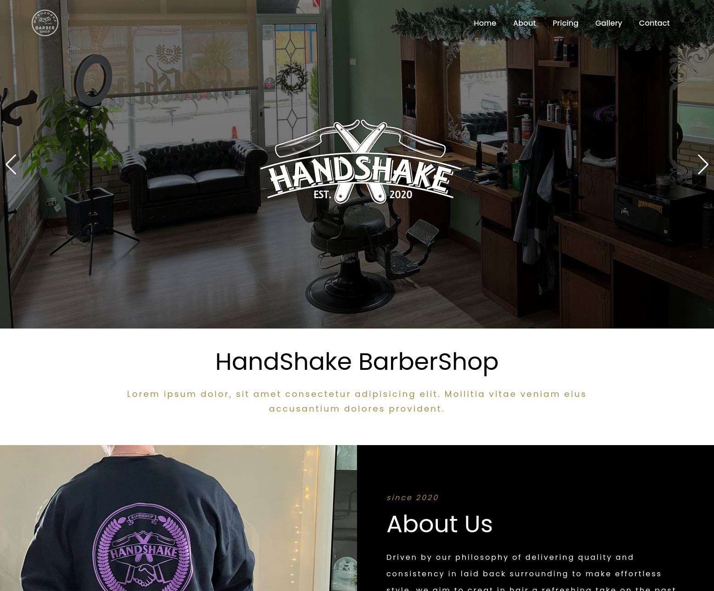

<div align="center">
  <a href="https://handshake-barbershop.netlify.app/">
    
  </a>

  <h3 align="center">HandShake BarberShop</h3>

  <p align="center">
    A simple landing page for HandShake BarberShop.
    <br />
    <br />
    <a href="https://handshake-barbershop.netlify.app/">View Demo</a>
  </p>
</div>

<!-- ABOUT THE PROJECT -->
## About The Project



### Built With

* [SCSS](https://sass-lang.com/)
* [Jekyll](https://jekyllrb.com/)
* [Netlify](https://www.netlify.com/)

<!-- GETTING STARTED -->
## Getting Started

To get a local copy up and running follow these simple steps.
1. ```bundle install```
2. ```bundle exec jekyll serve```
3. Open your browser and go to ```http://localhost:4000```

<!-- ROADMAP -->
## Roadmap

- [ ] Add / Complete text
- [ ] Add images (those are not final)
- [ ] Add links
- [ ] Polish logos
- [ ] Multi-language Support
    - [ ] Greek

